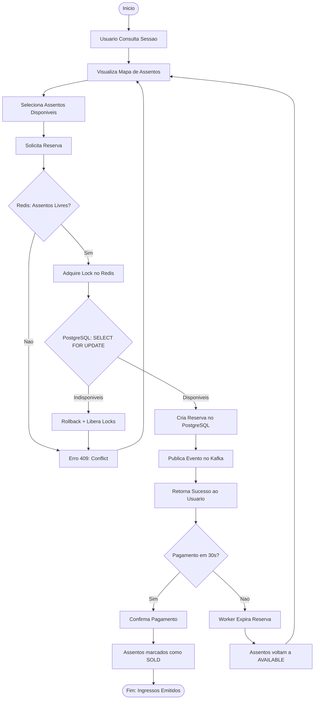
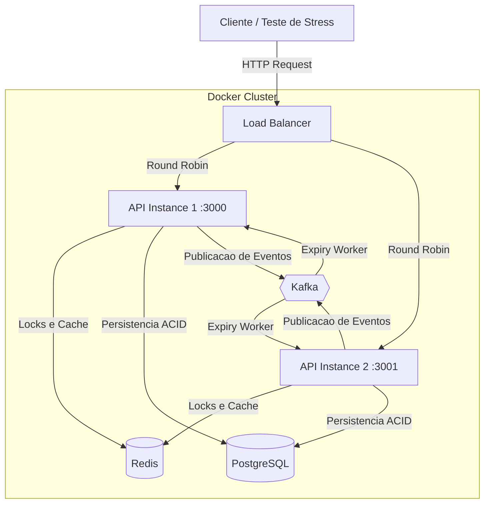
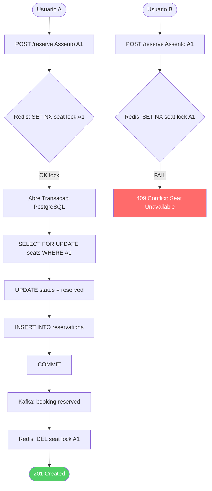
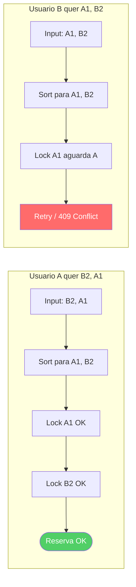
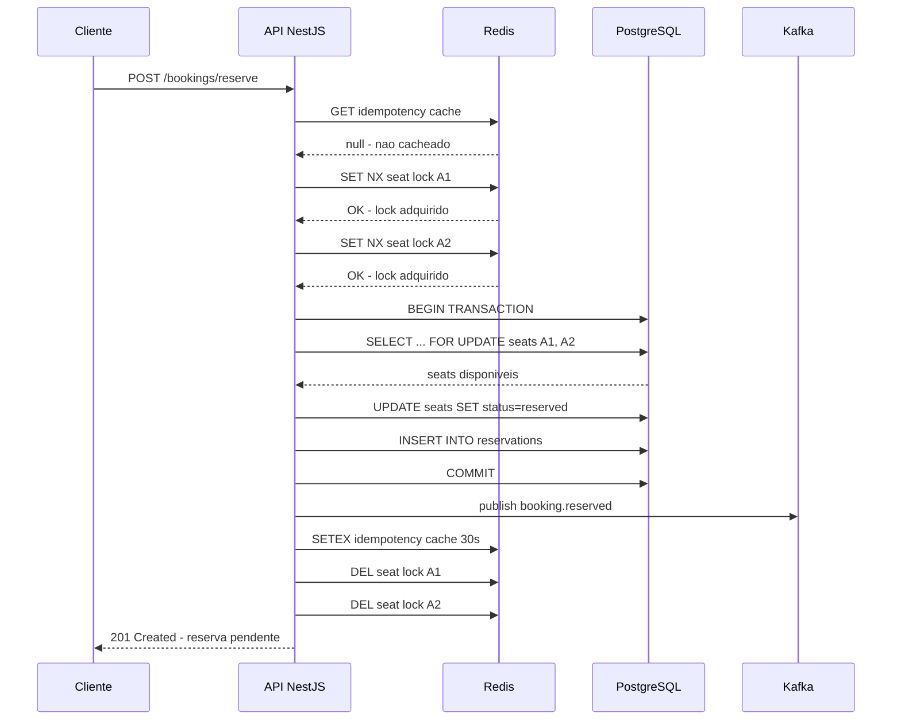
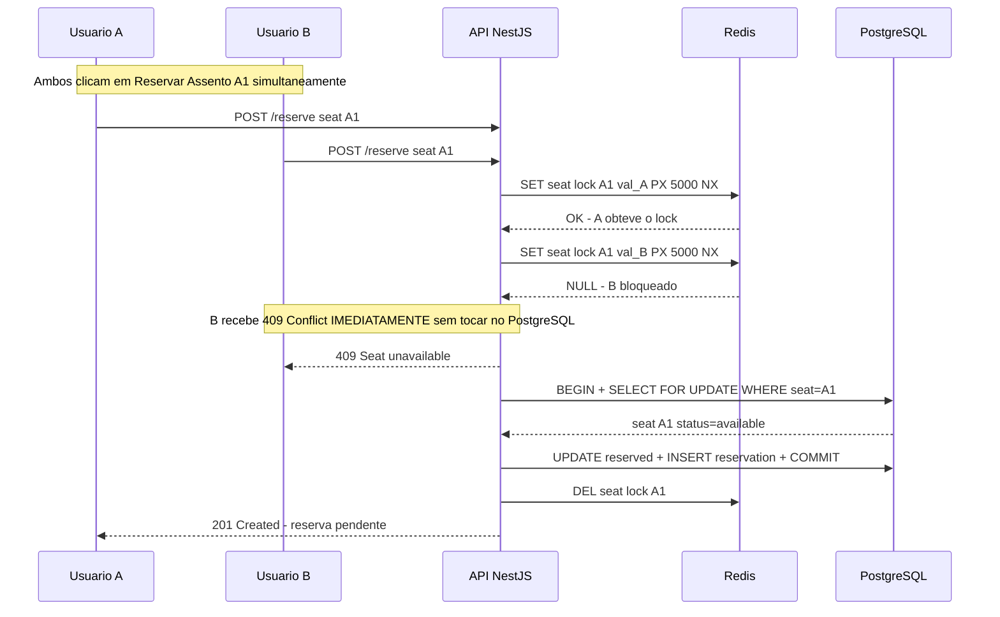
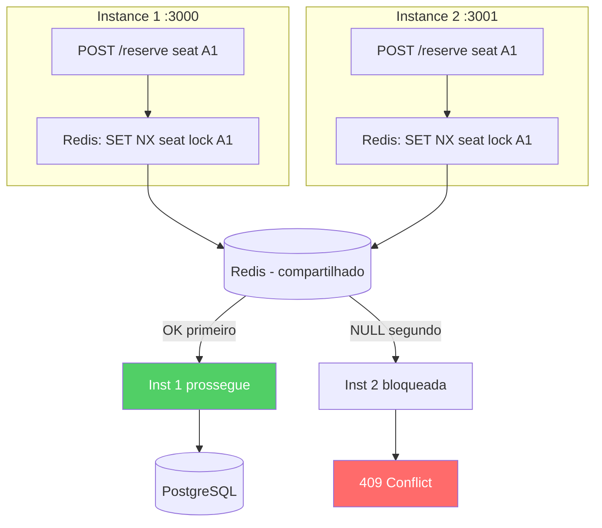
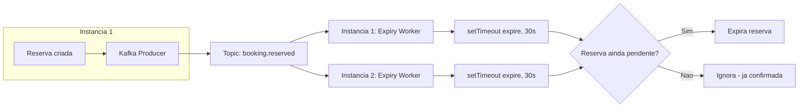
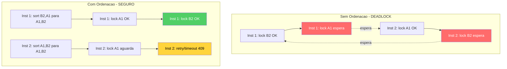

# 🎬 Cinema Booking System — Backend Challenge


> Sistema de venda de ingressos de cinema com **proteção contra concorrência**, **locks distribuídos** e **mensageria assíncrona**. Projetado para rodar em múltiplas instâncias simultâneas sem race conditions, deadlocks ou reservas duplicadas.

---

## 📑 Índice

- [Visão Geral](#-visão-geral)
- [Diagramas da Solução](#-diagramas-da-solução)
- [Tecnologias Escolhidas](#-tecnologias-escolhidas)
- [Como Executar](#-como-executar)
  - [Via Docker (Produção)](#51-via-docker-produção)
  - [Via npm run start:dev (Desenvolvimento)](#52-via-npm-run-startdev-desenvolvimento-local)
- [Documentação da API (Swagger)](#-documentação-da-api-swaggeropenapi)
- [Endpoints da API](#-endpoints-da-api)
- [Estratégias de Concorrência](#-estratégias-de-concorrência)
  - [Solução para Race Conditions](#91-solução-para-race-conditions-condição-de-corrida)
  - [Coordenação entre Instâncias](#92-coordenação-entre-instâncias)
  - [Prevenção de Deadlocks](#93-prevenção-de-deadlocks)
- [Arquitetura Detalhada](#-arquitetura-detalhada)
- [Estrutura do Projeto](#-estrutura-do-projeto)
- [Decisões Técnicas](#-decisões-técnicas)
- [Rate Limiting](#-rate-limiting)
- [Limitações Conhecidas](#-limitações-conhecidas)
- [Testes](#-testes)
  - [Testes Unitários](#testes-unitários)
  - [Testes de Integração e Concorrência](#testes-de-integraçãoconcorrência)
  - [Scripts de Teste](#scripts-de-teste)
- [Troubleshooting](#-troubleshooting)
- [Autor](#-autor)

---

## 🔭 Visão Geral

### Contexto

Este projeto foi desenvolvido como **desafio técnico para vaga de Desenvolvedor Back-End**. O cenário simula uma plataforma real de venda de ingressos onde **milhares de usuários concorrem pelos mesmos assentos simultaneamente**.

### O Problema

Em sistemas de reserva, o principal desafio é garantir que:

- **Apenas um usuário** consiga reservar um assento específico, mesmo com requisições simultâneas
- **Nenhum dinheiro seja cobrado** sem uma reserva válida
- **Reservas abandonadas** liberem os assentos automaticamente
- O sistema funcione corretamente com **múltiplas instâncias** da API

### Diagrama de Arquitetura

```
┌─────────────┐     ┌─────────────────────────────────────────────┐
│   Clientes  │     │              Docker Network                 │
│  (Browser/  │     │                                             │
│   Mobile)   │     │  ┌─────────────┐    ┌─────────────┐        │
│             ├────►│  │  API Inst 1  │    │  API Inst 2  │       │
└─────────────┘     │  │  :3000       │    │  :3001       │       │
                    │  └──────┬───────┘    └──────┬───────┘       │
                    │         │                   │               │
                    │         ▼                   ▼               │
                    │  ┌─────────────┐    ┌─────────────┐        │
                    │  │ PostgreSQL  │    │    Redis     │        │
                    │  │   :5432     │    │   :6379      │        │
                    │  │ (ACID/Data) │    │ (Locks/Cache)│        │
                    │  └─────────────┘    └─────────────┘        │
                    │                                             │
                    │  ┌─────────────┐    ┌─────────────┐        │
                    │  │  Zookeeper  │───►│    Kafka     │        │
                    │  │   :2181     │    │   :9092      │        │
                    │  │             │    │  (Eventos)   │        │
                    │  └─────────────┘    └─────────────┘        │
                    └─────────────────────────────────────────────┘
```

---

## 📊 Diagramas da Solução

### Fluxo Simplificado de Compra



### Arquitetura de Infraestrutura (Cluster)



---

### Fluxo de Resolução de Conflito (Race Condition)



### Fluxo Anti-Deadlock (Ordenação de Locks)



## 🛠️ Tecnologias Escolhidas

| Tecnologia         | Versão | Alternativas Consideradas | Por Que Escolhemos                                                                             |
| :----------------- | :----: | :------------------------ | :--------------------------------------------------------------------------------------------- |
| **PostgreSQL**     |   15   | MongoDB, MySQL            | Compliance ACID, Row-Level Locking, `SELECT FOR UPDATE`, suporte a arrays UUID                 |
| **Redis**          |   7    | Memcached, Zookeeper      | `SET NX PX` atômico para locks, TTL automático, latência < 1ms, cache de idempotência          |
| **Apache Kafka**   |  7.5   | RabbitMQ, AWS SQS         | Durabilidade de mensagens, replay de eventos, auditoria completa, alto throughput              |
| **NestJS**         |   11   | Express puro, Fastify     | Injeção de dependência nativa, TypeScript-first, arquitetura modular, Swagger integrado        |
| **TypeORM**        |  0.3   | Prisma, Sequelize         | Decorators nativos para entidades, `QueryRunner` para transações, integração direta com NestJS |
| **Docker Compose** |   —    | Kubernetes, bare-metal    | Setup simplificado, reprodutibilidade, orquestração local de todos os serviços                 |

---

## 🚀 Como Executar

Existem **duas formas** de rodar o projeto:

| Método                      | Ideal Para                     | Precisa criar `.env`? |   Instâncias da API    |
| :-------------------------- | :----------------------------- | :-------------------: | :--------------------: |
| **Via Docker**              | Simular produção, testes E2E   |          ❌           | 2 (portas 3000 e 3001) |
| **Via `npm run start:dev`** | Desenvolvimento com hot-reload |      ✅ **Sim**       |     1 (porta 3000)     |

### Pré-requisitos

| Ferramenta     | Versão Mínima         | Necessário Para       |
| :------------- | :-------------------- | :-------------------- |
| Git            | 2+                    | Ambos                 |
| Docker         | 20+                   | Docker                |
| Docker Compose | 2+                    | Docker                |
| Node.js        | 18+ (recomendado 20+) | Desenvolvimento local |
| npm            | 9+                    | Desenvolvimento local |

> **📝 Sobre o arquivo `.env`:**
>
> - **Via Docker:** Não precisa criar `.env` — as variáveis estão no `docker-compose.yml`
> - **Via `npm run start:dev`:** É **obrigatório** criar o arquivo `.env` na raiz do projeto (veja [Passo 4 da seção 5.2](#52-via-npm-run-startdev-desenvolvimento-local))

---

### 5.1 Via Docker (Produção)

Esta opção sobe **toda a infraestrutura** (PostgreSQL, Redis, Kafka, Zookeeper) e **2 instâncias da API** (portas 3000 e 3001) com um único comando.

**Passo 1 — Clonar o repositório:**

```bash
git clone https://github.com/daviixs/starsoft-backend-challenge.git
cd starsoft-backend-challenge
```

**Passo 2 — Subir todos os serviços:**

```bash
docker-compose up --build -d
```

> ⏱ A primeira build pode levar ~2 minutos. O Docker Compose aguarda os health checks de PostgreSQL, Redis e Kafka antes de iniciar as instâncias da API.

> ⚠️ **Não é necessário criar arquivo `.env`** ao rodar via Docker — todas as variáveis de ambiente estão configuradas no `docker-compose.yml`.

**Passo 3 — Verificar que tudo está rodando:**

```bash
# Ver status dos containers
docker-compose ps

# Health check completo (DB + Redis)
curl http://localhost:3000/api/health
```

**Resposta esperada:**

```json
{
  "status": "ok",
  "info": {
    "database": { "status": "up" },
    "redis": { "status": "up" }
  }
}
```

**Passo 4 — Popular dados iniciais:**

```bash
bash scripts/seed-data.sh
```

**Passo 5 — Acessar a API:**

| Recurso           | URL                                |
| :---------------- | :--------------------------------- |
| API (Instância 1) | `http://localhost:3000/api`        |
| API (Instância 2) | `http://localhost:3001/api`        |
| Swagger Docs      | `http://localhost:3000/api/docs`   |
| Health Check      | `http://localhost:3000/api/health` |

**Parar tudo:**

```bash
docker-compose down       # Para os containers (mantém dados)
docker-compose down -v    # Para os containers e apaga volumes (reset completo)
```

---

### 5.2 Via `npm run start:dev` (Desenvolvimento Local)

Esta opção roda a API localmente com **hot-reload** (reinicia automaticamente a cada alteração de código). Você ainda precisa de PostgreSQL, Redis e Kafka rodando — o jeito mais fácil é subi-los via Docker.

**Passo 1 — Clonar o repositório:**

```bash
git clone https://github.com/daviixs/starsoft-backend-challenge.git
cd starsoft-backend-challenge
```

**Passo 2 — Instalar dependências:**

```bash
npm install
```

**Passo 3 — Subir apenas a infraestrutura (banco, cache, mensageria):**

```bash
docker-compose up -d postgres redis zookeeper kafka
```

> Isso sobe **apenas** PostgreSQL, Redis, Zookeeper e Kafka. A API **não** sobe no Docker — você vai rodá-la localmente.

**Passo 4 — Criar arquivo `.env` (obrigatório para dev local):**

> ⚠️ **Importante:** Ao rodar localmente com `npm run start:dev`, você **PRECISA** criar o arquivo `.env` na raiz do projeto.

Crie um arquivo chamado `.env` na raiz (mesmo nível do `package.json`):

```bash
NODE_ENV=development
PORT=3000
DATABASE_HOST=localhost
DATABASE_PORT=5432
DATABASE_USER=cinema
DATABASE_PASSWORD=cinema123
DATABASE_NAME=cinema_booking
REDIS_HOST=localhost
REDIS_PORT=6379
KAFKA_BROKERS=localhost:9092
KAFKA_CLIENT_ID=cinema-app-dev
KAFKA_GROUP_ID=cinema-booking-group
```

Ou copie o arquivo de exemplo (se existir):

```bash
cp .env.example .env
```

**Passo 5 — Iniciar a API em modo desenvolvimento:**

```bash
npm run start:dev
```

Você verá no terminal:

```
Application is running on: http://localhost:3000/api
Swagger docs: http://localhost:3000/api/docs
Health check: http://localhost:3000/api/health
```

> A cada alteração em qualquer arquivo `.ts` dentro de `src/`, o NestJS recompila e reinicia automaticamente.

**Passo 6 — Verificar saúde e popular dados:**

```bash
curl http://localhost:3000/api/health
bash scripts/seed-data.sh
```

| Recurso      | URL                                |
| :----------- | :--------------------------------- |
| API          | `http://localhost:3000/api`        |
| Swagger Docs | `http://localhost:3000/api/docs`   |
| Health Check | `http://localhost:3000/api/health` |

---

## 📖 Documentação da API (Swagger/OpenAPI)

A API possui documentação interativa gerada automaticamente pelo **Swagger/OpenAPI**, acessível em `http://localhost:3000/api/docs`. O Swagger é configurado diretamente no `main.ts` utilizando o `@nestjs/swagger`, onde definimos título, descrição e tags que organizam os endpoints por domínio (**Sessions** e **Bookings**). Cada rota da API é decorada com `@ApiOperation`, `@ApiResponse` e `@ApiParam`, o que garante que a documentação reflita exatamente o comportamento real do código — incluindo os códigos HTTP possíveis (201, 404, 409, 410, 429) e a descrição de cada cenário. Os DTOs utilizam decorators do `class-validator` (como `@IsUUID`, `@IsArray`, `@Matches`) que são automaticamente expostos no schema do Swagger, permitindo que qualquer desenvolvedor visualize as validações exigidas por cada campo sem precisar ler o código-fonte. Além de servir como referência para o time, o Swagger funciona como ferramenta de teste: é possível executar requisições diretamente pela interface web, facilitando a depuração durante o desenvolvimento.

```
http://localhost:3000/api/docs
```

---

## 📡 Endpoints da API

Todos os endpoints utilizam o prefixo `/api`.

### 📌 POST `/api/sessions` — Criar Sessão de Cinema

Cria uma sessão com assentos gerados automaticamente (formato A1, A2, ..., B1, B2, ...).

**Request:**

```bash
curl -X POST http://localhost:3000/api/sessions \
  -H "Content-Type: application/json" \
  -d '{
    "movieName": "Oppenheimer",
    "roomNumber": 1,
    "startsAt": "2026-02-15T19:00:00Z",
    "priceCents": 2500,
    "totalSeats": 24
  }'
```

| Campo        | Tipo     | Regras      | Descrição                           |
| :----------- | :------- | :---------- | :---------------------------------- |
| `movieName`  | string   | 1–255 chars | Nome do filme                       |
| `roomNumber` | int      | 1–20        | Número da sala                      |
| `startsAt`   | ISO 8601 | futuro      | Data/hora da sessão                 |
| `priceCents` | int      | ≥ 1000      | Preço em centavos (2500 = R$ 25,00) |
| `totalSeats` | int      | 16–100      | Quantidade de assentos              |

**Response `201`:**

```json
{
  "id": "7527e3a4-e170-4ac5-97a2-061fd1fe421e",
  "movieName": "Oppenheimer",
  "roomNumber": 1,
  "startsAt": "2026-02-15T19:00:00.000Z",
  "priceCents": 2500,
  "createdAt": "2026-02-09T21:50:00.000Z"
}
```

---

### 📌 GET `/api/sessions` — Listar Sessões

```bash
curl http://localhost:3000/api/sessions
```

**Response `200`:**

```json
[
  {
    "id": "7527e3a4-e170-4ac5-97a2-061fd1fe421e",
    "movieName": "Oppenheimer",
    "roomNumber": 1,
    "startsAt": "2026-02-15T19:00:00.000Z",
    "priceCents": 2500,
    "createdAt": "2026-02-09T21:50:00.000Z"
  }
]
```

---

### 📌 GET `/api/sessions/:id/availability` — Disponibilidade em Tempo Real

Retorna o estado de todos os assentos: disponíveis, reservados e vendidos.

```bash
curl http://localhost:3000/api/sessions/7527e3a4-e170-4ac5-97a2-061fd1fe421e/availability
```

**Response `200`:**

```json
{
  "session": {
    "id": "7527e3a4-...",
    "movieName": "Oppenheimer",
    "roomNumber": 1,
    "startsAt": "2026-02-15T19:00:00.000Z",
    "priceCents": 2500
  },
  "availableSeats": ["A1", "A2", "A3", "B1", "B2", "B3"],
  "reservedSeats": ["C1"],
  "soldSeats": ["D1", "D2"]
}
```

| Status | Descrição                                 |
| :----- | :---------------------------------------- |
| `404`  | `{ "message": "Session {id} not found" }` |

---

### 📌 POST `/api/bookings/reserve` — Reservar Assentos

Reserva assentos com **lock distribuído** + **transação PostgreSQL**. A reserva expira em **30 segundos** se o pagamento não for confirmado.

**Request:**

```bash
curl -X POST http://localhost:3000/api/bookings/reserve \
  -H "Content-Type: application/json" \
  -d '{
    "userId": "a1b2c3d4-e5f6-7890-abcd-ef1234567890",
    "sessionId": "7527e3a4-e170-4ac5-97a2-061fd1fe421e",
    "seatNumbers": ["A1", "A2"]
  }'
```

| Campo         | Tipo     | Regras                             | Descrição          |
| :------------ | :------- | :--------------------------------- | :----------------- |
| `userId`      | UUID v4  | obrigatório                        | ID do usuário      |
| `sessionId`   | UUID v4  | obrigatório                        | ID da sessão       |
| `seatNumbers` | string[] | 1–10 itens, formato `[A-H]\d{1,2}` | Assentos desejados |

**Response `201`:**

```json
{
  "id": "res-uuid-...",
  "userId": "a1b2c3d4-...",
  "sessionId": "7527e3a4-...",
  "seatIds": ["seat-uuid-1", "seat-uuid-2"],
  "expiresAt": "2026-02-09T22:30:30.000Z",
  "status": "pending",
  "message": "Reservation confirmed. Complete payment within 30 seconds."
}
```

| Status | Descrição                                          |
| :----- | :------------------------------------------------- |
| `409`  | Assento(s) indisponível(is) — já reservado/vendido |
| `404`  | Sessão não encontrada                              |
| `429`  | Rate limit excedido (máx 5 reservas/minuto por IP) |

---

### 📌 POST `/api/bookings/confirm` — Confirmar Pagamento

Converte uma reserva pendente em venda definitiva. Os assentos passam de `reserved` para `sold`.

**Request:**

```bash
curl -X POST http://localhost:3000/api/bookings/confirm \
  -H "Content-Type: application/json" \
  -d '{
    "reservationId": "res-uuid-...",
    "userId": "a1b2c3d4-..."
  }'
```

| Campo            | Tipo    | Regras      | Descrição                           |
| :--------------- | :------ | :---------- | :---------------------------------- |
| `reservationId`  | UUID v4 | obrigatório | ID da reserva                       |
| `userId`         | UUID v4 | obrigatório | ID do usuário que fez a reserva     |
| `idempotencyKey` | string  | opcional    | Chave para evitar dupla confirmação |

**Response `201`:**

```json
{
  "id": "sale-uuid-...",
  "reservationId": "res-uuid-...",
  "userId": "a1b2c3d4-...",
  "totalAmountCents": 5000,
  "confirmedAt": "2026-02-09T22:30:15.000Z",
  "message": "Payment confirmed successfully!"
}
```

| Status | Descrição                                 |
| :----- | :---------------------------------------- |
| `404`  | Reserva não encontrada                    |
| `410`  | Reserva expirada (passou dos 30 segundos) |
| `409`  | Confirmação já em andamento (lock)        |

---

### 📌 GET `/api/bookings/user/:userId` — Histórico de Compras

```bash
curl http://localhost:3000/api/bookings/user/a1b2c3d4-e5f6-7890-abcd-ef1234567890
```

**Response `200`:**

```json
{
  "userId": "a1b2c3d4-...",
  "totalPurchases": 1,
  "purchases": [
    {
      "id": "sale-uuid-...",
      "totalAmountCents": 5000,
      "confirmedAt": "2026-02-09T22:30:15.000Z",
      "movie": "Oppenheimer",
      "startsAt": "2026-02-15T19:00:00.000Z",
      "seats": 2
    }
  ]
}
```

---

### 📌 GET `/api/bookings/reservation/:id` — Status de Reserva

```bash
curl http://localhost:3000/api/bookings/reservation/res-uuid-...
```

**Response `200`:**

```json
{
  "id": "res-uuid-...",
  "userId": "a1b2c3d4-...",
  "sessionId": "7527e3a4-...",
  "seatIds": ["seat-uuid-1", "seat-uuid-2"],
  "expiresAt": "2026-02-09T22:30:30.000Z",
  "status": "pending",
  "isExpired": false,
  "timeRemaining": 22
}
```

---

### 📌 GET `/api/health` — Health Check

```bash
curl http://localhost:3000/api/health
```

**Response `200`:**

```json
{
  "status": "ok",
  "info": {
    "database": { "status": "up" },
    "redis": { "status": "up" }
  }
}
```

---

## 🔐 Estratégias de Concorrência

O sistema implementa **3 camadas de proteção** para garantir integridade em um ambiente distribuído com múltiplas instâncias:

### 7.1 Camada 1 — Redis Distributed Lock (`SET NX PX`)

A primeira barreira é um **lock distribuído via Redis**. Antes de qualquer operação no banco, a API tenta adquirir locks exclusivos para cada assento:

```
SET seat:lock:{sessionId}:{seatNumber} {lockValue} PX 5000 NX
```

- **`NX`** — só seta se a chave **não existir** (exclusão mútua)
- **`PX 5000`** — expira automaticamente em 5s (previne locks órfãos)
- **Liberação via Lua Script** — garante que apenas o dono do lock pode liberá-lo

```lua
if redis.call("get", KEYS[1]) == ARGV[1] then
  return redis.call("del", KEYS[1])
else
  return 0
end
```

**Por que Redis e não só PostgreSQL?** Redis opera em < 1ms. Ele rejeita requisições duplicadas **antes** de abrir uma transação no banco, economizando conexões do pool.

---

### 7.2 Camada 2 — PostgreSQL Transaction + `SELECT FOR UPDATE`

Mesmo com o Redis protegendo, a transação no PostgreSQL garante **ACID**:

```sql
BEGIN;

  SELECT * FROM seats
  WHERE session_id = $1 AND seat_number IN ($2, $3)
    AND status = 'available'
  ORDER BY seat_number ASC
  FOR UPDATE;  -- Lock pessimista na linha

  UPDATE seats SET status = 'reserved', reserved_until = $4
  WHERE id IN (...);

  INSERT INTO reservations (user_id, session_id, seat_ids, expires_at, status)
  VALUES ($5, $1, $6, $4, 'pending');

COMMIT;
```

O `FOR UPDATE` bloqueia as linhas dos assentos até o `COMMIT`, impedindo que outra transação leia/modifique os mesmos dados.

---

### 7.3 Camada 3 — Idempotência com Cache

Requisições idênticas (mesmo usuário + mesma sessão + mesmos assentos) dentro de **30 segundos** retornam o resultado cacheado:

```
Chave: reserve:{userId}:{sessionId}:{seatNumbers sorted}
TTL:   30 segundos
```

Isso protege contra:

- Clique duplo do usuário
- Retry automático do frontend
- Timeout + reenvio

---

### Diagrama de Sequência — Fluxo de Reserva



---

### 7.4 Como Garantimos Idempotência

| Operação    | Chave de Idempotência                         | TTL  |
| :---------- | :-------------------------------------------- | :--- |
| Reserva     | `reserve:{userId}:{sessionId}:{seats sorted}` | 30s  |
| Confirmação | `confirm:{reservationId}:{userId}`            | 300s |

Além disso, a tabela `sales` possui constraint `UNIQUE(reservation_id)`, impedindo dupla confirmação mesmo em caso de falha do cache.

---

## 🏁 9. Solução Detalhada para Problemas de Concorrência

Esta seção explica **em profundidade** como o sistema lida com os três maiores desafios de um sistema distribuído de reservas.

---

### 9.1 Solução para Race Conditions (Condição de Corrida)

#### O Problema

Quando 10 usuários clicam em "Reservar" no **mesmo assento ao mesmo tempo**, sem proteção adequada, todos leem o assento como `available` e todos executam o `UPDATE` — resultando em **10 reservas para 1 único assento**.

```
Timeline SEM proteção:

  t=0ms  Usuário A → SELECT status FROM seats WHERE A1  → 'available' ✅
  t=1ms  Usuário B → SELECT status FROM seats WHERE A1  → 'available' ✅  ← STALE READ!
  t=2ms  Usuário A → UPDATE seats SET status='reserved'  → OK
  t=3ms  Usuário B → UPDATE seats SET status='reserved'  → OK  ← DOUBLE BOOKING!
```

#### Nossa Solução: Defesa em 3 Camadas

Implementamos uma estratégia de **defesa em profundidade** (defense-in-depth) onde cada camada complementa a anterior:

```
┌─────────────────────────────────────────────────────────┐
│         CAMADA 1: Redis Distributed Lock (< 1ms)        │
│   Barreira rápida — rejeita 9 de 10 requisições         │
│   antes de tocar no banco de dados                      │
├─────────────────────────────────────────────────────────┤
│         CAMADA 2: PostgreSQL SELECT FOR UPDATE           │
│   Garantia ACID — mesmo se o Redis falhar,              │
│   o banco garante consistência via lock pessimista       │
├─────────────────────────────────────────────────────────┤
│         CAMADA 3: Cache de Idempotência (Redis)          │
│   Deduplicação — requisições idênticas em < 30s          │
│   retornam o mesmo resultado sem reprocessar             │
└─────────────────────────────────────────────────────────┘
```

#### Por que 3 camadas e não apenas 1?

| Cenário de falha                         |  Camada 1 (Redis Lock)   | Camada 2 (PG Transaction) | Camada 3 (Idempotência) |
| :--------------------------------------- | :----------------------: | :-----------------------: | :---------------------: |
| 10 usuários simultâneos no mesmo assento | ✅ 1 passa, 9 bloqueados |             —             |            —            |
| Redis cai momentaneamente                |         ❌ Falha         |  ✅ `FOR UPDATE` protege  |            —            |
| Usuário clica 2x rápido                  |   ✅ Lock ainda ativo    |             —             |    ✅ Retorna cache     |
| Retry do frontend após timeout           |            —             |             —             |    ✅ Retorna cache     |
| Lock Redis expira antes do COMMIT        |      ❌ Outro entra      | ✅ `FOR UPDATE` bloqueia  |            —            |

> **Escolha técnica:** A Camada 1 (Redis) é otimista e rápida. A Camada 2 (PostgreSQL) é pessimista e segura. Juntas, oferecem **velocidade + garantia ACID**.

#### Fluxo Detalhado com Race Condition



#### Código que implementa a proteção (BookingsService)

```typescript
async reserveSeats(dto: ReserveSeatsDto): Promise<Reservation> {
  // CAMADA 3: Idempotência — retorna cache se existir
  const cached = await this.redisLock.getCache<Reservation>(idempotencyKey);
  if (cached) return cached;

  // CAMADA 1: Redis Lock — aquisição em ORDEM ALFABÉTICA
  const locks = await this.redisLock.acquireMultiple(lockKeys, 5000);
  if (!locks) throw new SeatUnavailableException(seatNumbers);

  try {
    // CAMADA 2: PostgreSQL — SELECT FOR UPDATE (lock pessimista)
    const seats = await queryRunner.manager.find(Seat, {
      where: { sessionId, seatNumber: In(sortedSeatNumbers), status: 'available' },
      lock: { mode: 'pessimistic_write' }, // ← FOR UPDATE
    });

    if (seats.length !== sortedSeatNumbers.length) {
      throw new SeatUnavailableException(unavailable);
    }
    // ... UPDATE + INSERT + COMMIT
  } finally {
    await this.redisLock.releaseMultiple(locks); // Sempre libera
  }
}
```

---

### 9.2 Coordenação entre Instâncias

#### O Problema

Com **2+ instâncias** da API rodando simultaneamente (cinema-app-1 na porta 3000, cinema-app-2 na porta 3001), variáveis locais e locks em memória **não servem** — cada instância vive em um processo isolado.

```
┌──────────────────────┐    ┌──────────────────────┐
│    cinema-app-1      │    │    cinema-app-2      │
│  lock em memória: {} │    │  lock em memória: {} │
│  (isolado!)          │    │  (isolado!)          │
└──────────┬───────────┘    └──────────┬───────────┘
           │  Ambos acham que o seat A1 está livre!
           ▼                           ▼
    ┌─────────────────────────────────────────┐
    │          PostgreSQL (compartilhado)      │
    │  Sem coordenação → DOUBLE BOOKING        │
    └─────────────────────────────────────────┘
```

#### Nossa Solução: Redis como Ponto Central de Coordenação

O Redis é o **único ponto de verdade** para locks, acessível por todas as instâncias:



#### Mecanismos de Coordenação Implementados

| Mecanismo                 | Tecnologia              | Propósito                                   | Escopo          |
| :------------------------ | :---------------------- | :------------------------------------------ | :-------------- |
| **Lock Distribuído**      | Redis `SET NX PX`       | Exclusão mútua entre instâncias             | Por assento     |
| **Lock Pessimista**       | PostgreSQL `FOR UPDATE` | Consistência ACID final                     | Por linha no DB |
| **Cache de Idempotência** | Redis `SETEX`           | Evitar reprocessamento duplicado            | Por requisição  |
| **Mensageria**            | Kafka topics            | Notificar todas as instâncias sobre eventos | Global          |
| **Cron Distribuído**      | `@nestjs/schedule`      | Expiração de reservas (cada instância roda) | Por instância   |

#### Por que Redis SET NX funciona entre instâncias?

O comando `SET key value PX ttl NX` é **atômico no Redis** — o servidor Redis processa um comando por vez (single-threaded para operações de dados). Quando duas instâncias enviam `SET NX` para a mesma chave **no mesmo microssegundo**:

```
t=0.000ms  Inst 1 → SET seat:lock:A1 "inst1-lock" PX 5000 NX
t=0.000ms  Inst 2 → SET seat:lock:A1 "inst2-lock" PX 5000 NX

→ Redis serializa internamente:
  1. Processa Inst 1 → chave não existe → SET → retorna OK
  2. Processa Inst 2 → chave JÁ existe → retorna NULL

→ Resultado: garantia de que APENAS 1 instância obtém o lock
```

#### Liberação segura com Lua Script

O Lua script garante que **apenas o dono do lock** pode liberá-lo — evitando que uma instância libere o lock de outra:

```lua
-- Executado atomicamente no Redis
if redis.call("get", KEYS[1]) == ARGV[1] then
  return redis.call("del", KEYS[1])   -- Só deleta se o valor bate
else
  return 0                             -- Não é meu lock, não toco
end
```

**Cenário que isso protege:**

```
t=0ms    Inst 1 adquire lock (valor="inst1-abc")
t=4999ms Lock está prestes a expirar
t=5000ms Lock expira automaticamente (PX 5000)
t=5001ms Inst 2 adquire o MESMO lock (valor="inst2-xyz")
t=5002ms Inst 1 termina processamento e tenta DEL
         → Lua script verifica: "inst1-abc" ≠ "inst2-xyz"
         → NÃO deleta! Lock da Inst 2 permanece seguro ✅
```

#### Kafka como canal de comunicação assíncrona

O Kafka permite que eventos de uma instância sejam **consumidos por todas as outras**:



> **Nota:** Mesmo que ambas as instâncias tentem expirar a mesma reserva, a operação é idempotente — a transação no PostgreSQL verifica `status = 'pending'` antes de atualizar.

---

### 9.3 Prevenção de Deadlocks

#### O Problema

Um **deadlock** ocorre quando dois processos ficam travados esperando um pelo outro, indefinidamente:

```
SEM ordenação de locks:

  Inst 1: adquire lock A1 → tenta lock B2 → ⏳ esperando Inst 2 liberar B2
  Inst 2: adquire lock B2 → tenta lock A1 → ⏳ esperando Inst 1 liberar A1

  → DEADLOCK! Nenhum dos dois avança. Sistema trava.
```

#### Nossa Solução: Ordered Lock Acquisition (Aquisição Ordenada de Locks)

A técnica clássica para prevenir deadlocks é **impor uma ordem global** na aquisição de locks. Se todos os processos adquirem locks **na mesma ordem**, é impossível formarem um ciclo de espera.

**Implementação:**

```typescript
// RedisLockService.acquireMultiple()
async acquireMultiple(keys: string[], ttlMs = 5000) {
  const sortedKeys = [...keys].sort(); // ← CHAVE: ordem alfabética
  const acquiredLocks = new Map<string, string>();

  for (const key of sortedKeys) {
    const lockValue = await this.acquire(key, ttlMs);
    if (!lockValue) {
      // Se falhar em QUALQUER lock, libera TODOS os já adquiridos
      await this.releaseMultiple(acquiredLocks);
      return null;
    }
    acquiredLocks.set(key, lockValue);
  }
  return acquiredLocks;
}
```

#### Prova de que NÃO há deadlock



#### Mecanismo de Rollback em Falha Parcial

Se a aquisição do **segundo lock** falha (por timeout ou lock já adquirido por outro), o sistema **libera todos os locks já adquiridos** antes de retornar erro:

```
Cenário: Usuário quer reservar [A1, B2, C3]

  1. sort() → [A1, B2, C3]
  2. lock(A1) → OK ✅
  3. lock(B2) → OK ✅
  4. lock(C3) → FALHA ❌ (outro usuário já tem)

  → Rollback automático:
    - release(A1) ✅
    - release(B2) ✅
    - Retorna null → Controller lança 409 Conflict

  → Nenhum lock fica "órfão" ocupando recursos
```

#### Proteção adicional: TTL nos locks

Mesmo em cenários extremos (crash da aplicação, network partition), os locks **expiram automaticamente** após 5 segundos (`PX 5000`):

```
t=0s     Inst 1 adquire lock(A1) com TTL=5s
t=0.5s   Inst 1 CRASH! (OOM, kill -9, etc)
t=5s     Lock expira automaticamente no Redis
t=5.1s   Inst 2 consegue adquirir lock(A1) normalmente

→ Sistema se recupera sozinho, sem intervenção manual
```

#### Tabela resumo: todas as proteções contra deadlocks

| Proteção                      | Mecanismo                                         | Onde                                 |
| :---------------------------- | :------------------------------------------------ | :----------------------------------- |
| **Ordenação de locks**        | `sort()` antes de `acquireMultiple()`             | `RedisLockService`                   |
| **Rollback em falha parcial** | Libera todos os locks adquiridos se um falhar     | `RedisLockService.acquireMultiple()` |
| **TTL automático**            | `PX 5000` em todo `SET NX`                        | Redis                                |
| **Liberação via Lua**         | Script atômico que verifica ownership             | `RedisLockService.release()`         |
| **Retry com backoff**         | Tentativas com `delay * (attempt + 1)`            | `RedisLockService.acquire()`         |
| **Ordenação no SQL**          | `ORDER BY seat_number ASC` no `SELECT FOR UPDATE` | `BookingsService`                    |

---

## 🏗 Arquitetura Detalhada

### 8.1 Diagrama de Componentes

```
┌─────────────────────────────────────────────────────────────────┐
│                        Docker Compose                           │
│                                                                 │
│  ┌────────────────────┐        ┌────────────────────┐          │
│  │   cinema-app-1     │        │   cinema-app-2     │          │
│  │   (NestJS :3000)   │        │   (NestJS :3001)   │          │
│  │                    │        │                    │          │
│  │ ┌──────────────┐   │        │ ┌──────────────┐   │          │
│  │ │ Controllers  │   │        │ │ Controllers  │   │          │
│  │ │ Services     │   │        │ │ Services     │   │          │
│  │ │ Workers      │   │        │ │ Workers      │   │          │
│  │ └──────────────┘   │        │ └──────────────┘   │          │
│  └─────────┬──────────┘        └─────────┬──────────┘          │
│            │                             │                     │
│       ┌────▼─────────────────────────────▼────┐                │
│       │                                       │                │
│  ┌────▼────┐   ┌─────────┐   ┌──────────────┐│                │
│  │PostgreSQL│   │  Redis  │   │    Kafka     ││                │
│  │  :5432  │   │  :6379  │   │    :9092     ││                │
│  │         │   │         │   │              ││                │
│  │• Sessões│   │• Locks  │   │• booking.*   ││                │
│  │• Seats  │   │• Cache  │   │  .reserved   ││                │
│  │• Reserv.│   │• Idemp. │   │  .confirmed  ││                │
│  │• Sales  │   │         │   │  .expired    ││                │
│  └─────────┘   └─────────┘   └──────────────┘│                │
│                                               │                │
└───────────────────────────────────────────────┘────────────────┘
```

### 8.2 Fluxo de Reserva (Step by Step)

1. **Cliente** → `POST /api/bookings/reserve` com `{ userId, sessionId, seatNumbers }`
2. **API** → Verifica se a sessão existe no PostgreSQL
3. **API** → Verifica cache de idempotência no Redis
4. **API** → `Redis.SET NX PX` para cada assento (ordem alfabética)
5. **API** → `PostgreSQL BEGIN TRANSACTION`
6. **API** → `SELECT FOR UPDATE` nos assentos
7. **API** → `UPDATE seats SET status = 'reserved'`
8. **API** → `INSERT INTO reservations`
9. **API** → `COMMIT`
10. **API** → `Kafka.publish('booking.reserved', { ... })`
11. **API** → `Redis.SETEX` cache de idempotência (30s)
12. **API** → Libera locks no Redis via Lua script
13. **API** → Retorna `201 { reservationId, expiresAt }`

### 8.3 Worker de Expiração de Reservas

O `ReservationExpiryWorker` opera em **duas frentes**:

**1. Cron Job (a cada 10 segundos):**

- Busca reservas com `status = 'pending'` e `expires_at < NOW()`
- Para cada reserva expirada:
  - `UPDATE seats SET status = 'available'`
  - `UPDATE reservations SET status = 'expired'`
  - `Kafka.publish('booking.expired', { ... })`

**2. Kafka Consumer (event-driven):**

- Escuta o tópico `booking.reserved`
- Ao receber evento, agenda `setTimeout` para verificar expiração após o TTL
- Garante expiração pontual mesmo entre ciclos do cron

### 8.4 Tópicos Kafka

| Tópico              | Evento               | Publicado Quando                 |
| :------------------ | :------------------- | :------------------------------- |
| `booking.reserved`  | Reserva criada       | Após commit da reserva           |
| `booking.confirmed` | Pagamento confirmado | Após commit da venda             |
| `booking.expired`   | Reserva expirada     | Após expirar reserva pelo worker |

---

## 📁 Estrutura do Projeto

```
src/
├── main.ts                          # Bootstrap, Swagger, ValidationPipe
├── app.module.ts                    # Módulo raiz (Config, TypeORM, Throttler)
├── app.controller.ts                # Controller raiz
├── app.service.ts                   # Service raiz
│
├── config/
│   ├── database.config.ts           # Configuração PostgreSQL (TypeORM)
│   ├── redis.config.ts              # Configuração Redis (ioredis)
│   └── kafka.config.ts              # Configuração Kafka (kafkajs)
│
├── sessions/
│   ├── sessions.module.ts           # Módulo de sessões
│   ├── sessions.controller.ts       # POST /sessions, GET /sessions, GET /sessions/:id/availability
│   └── sessions.service.ts          # Lógica de criação e consulta de sessões
│
├── booking/
│   ├── booking.module.ts            # Módulo de reservas
│   ├── booking.controller.ts        # POST /bookings/reserve, POST /bookings/confirm, GET /bookings/user/:id
│   ├── bookings.service.ts          # Lógica de reserva com locks + transações
│   └── use-cases/
│       └── reserve-seats.use-case.ts
│
├── modules/sessions/entities/
│   ├── session.entity.ts            # Entidade Session (filme, sala, horário, preço)
│   ├── seat.entity.ts               # Entidade Seat (assento, status, reservedUntil)
│   ├── reservation.entity.ts        # Entidade Reservation (userId, seatIds[], expiresAt)
│   └── sale.entity.ts               # Entidade Sale (reservationId, totalAmountCents)
│
├── dto/
│   ├── create-session.dto.ts        # DTO com validação (class-validator)
│   ├── reserve-seats.dto.ts         # DTO com regex para formato de assento
│   └── confirm-payment.dto.ts       # DTO com idempotencyKey opcional
│
├── redis/
│   └── redis-lock.service.ts        # Locks distribuídos (SET NX PX, Lua script, acquireMultiple)
│
├── kafka/
│   ├── kafka.module.ts              # Módulo Kafka
│   ├── kafka.producer.service.ts    # Publicação de eventos
│   └── kafka-consumer.service.ts    # Consumo de eventos
│
├── workers/
│   └── reservation-expiry.worker.ts # Cron + Kafka consumer para expirar reservas
│
├── health/
│   ├── health.module.ts             # Módulo de health check
│   └── health.controller.ts         # GET /health (DB + Redis)
│
├── exceptions/
│   └── business.exceptions.ts       # Exceptions customizadas (409, 404, 410)
│
└── shared/
    └── shared.module.ts             # Módulo compartilhado (Redis, Kafka exports)

test/
├── jest-e2e.json                    # Configuração Jest E2E
├── app.e2e-spec.ts                  # Testes E2E da aplicação
└── bookings.e2e-spec.ts             # Testes E2E de reservas e concorrência

scripts/
├── seed-data.sh                     # Popular dados iniciais
├── test-full-flow.sh                # Teste completo do fluxo (reserva → pagamento)
└── concurrency-test.sh              # Teste de concorrência (10 usuários simultâneos)
```

---

## 💡 Decisões Técnicas

### Por que Redis + PostgreSQL (Híbrido)?

| Componente     | Responsabilidade                                          | Latência |
| :------------- | :-------------------------------------------------------- | :------- |
| **Redis**      | Coordenação rápida entre instâncias (locks, idempotência) | < 1ms    |
| **PostgreSQL** | Persistência ACID, garantia de consistência final         | ~5ms     |

Usar **apenas PostgreSQL** exigiria `SELECT FOR UPDATE` em todas as requisições, sobrecarregando o pool de conexões. O Redis filtra requisições concorrentes **antes** de tocar no banco.

### Por que Kafka e não RabbitMQ?

- **Durabilidade**: mensagens persistidas em disco com retenção configurável
- **Replay**: possibilidade de reprocessar eventos passados
- **Auditoria completa**: log imutável de todos os eventos (`reserved`, `confirmed`, `expired`)
- **Scaling**: partições permitem consumo paralelo em múltiplas instâncias

### Por que TypeORM e não Prisma?

- **QueryRunner**: controle total sobre transações (`BEGIN`, `COMMIT`, `ROLLBACK`)
- **Lock pessimista**: suporte nativo a `SELECT FOR UPDATE` via `{ lock: { mode: 'pessimistic_write' } }`
- **Decorators**: entidades declarativas integradas ao ecossistema NestJS
- **Auto-sync**: `synchronize: true` para desenvolvimento rápido

### Por que Rate Limiting com @nestjs/throttler?

- **60 req/min** por IP (default)
- **5 req/min** para rotas sensíveis (reserve/confirm) — evita abuse de recursos
- Configuração por route via decorator `@Throttle()`

---

## 🛡️ Rate Limiting

O sistema implementa **Rate Limiting** (limitação de taxa de requisições) utilizando o módulo `@nestjs/throttler`, que atua como uma camada de proteção contra abuso e ataques de força bruta. O throttler é registrado como **Guard global** no `AppModule`, o que significa que **todas as rotas da API** são automaticamente protegidas sem necessidade de configuração individual. Definimos dois profiles de throttling: o **default** permite até **60 requisições por minuto** por IP, adequado para rotas de consulta como listar sessões ou verificar disponibilidade; e o **strict** permite apenas **5 requisições por minuto** por IP, aplicado via decorator `@Throttle({ strict: { ttl: 60000, limit: 5 } })` nas rotas críticas de reserva (`POST /bookings/reserve`) e confirmação de pagamento (`POST /bookings/confirm`). Essa diferença é intencional: rotas que modificam estado e consomem recursos (locks Redis, transações PostgreSQL, eventos Kafka) precisam de um limite mais agressivo para evitar que um único IP sobrecarregue o sistema. Quando o limite é excedido, a API retorna `HTTP 429 Too Many Requests`. Atualmente o rate limiting é baseado exclusivamente no endereço IP do cliente; em uma evolução futura, ele poderia ser combinado com autenticação JWT para limitar por `userId`, oferecendo uma granularidade mais justa.

| Profile     | Limite            | Aplicado Em                                        |
| :---------- | :---------------- | :------------------------------------------------- |
| **default** | 60 req/min por IP | Todas as rotas (global)                            |
| **strict**  | 5 req/min por IP  | `POST /bookings/reserve`, `POST /bookings/confirm` |

---

## ⚠️ Limitações Conhecidas

| Limitação                                         | Motivo                                                                                                                            |
| :------------------------------------------------ | :-------------------------------------------------------------------------------------------------------------------------------- |
| ❌ Dead Letter Queue (DLQ) não implementada       | Priorizado: fluxo core primeiro. Mensagens com falha são re-tentadas pelo Kafka, mas não há fila separada para erros persistentes |
| ❌ Métricas (Prometheus/Grafana) não configuradas | Escopo do desafio focava na lógica de concorrência                                                                                |
| ❌ Rate limiting apenas por IP                    | Uma solução produção teria rate limit por `userId` via token JWT                                                                  |
| ❌ Autenticação/Autorização não implementada      | O `userId` é passado no body. Em produção, viria de um JWT validado                                                               |
| ❌ Testes E2E com cobertura parcial               | Priorizados: cenários de concorrência e fluxo principal                                                                           |
| ❌ Dockerfile usa Node 18                         | Pode causar `crypto is not defined` em runtime — recomenda-se Node 20+                                                            |

---

## 🧪 Testes

### Testes Unitários

Os testes unitários do projeto utilizam **Jest** como framework, que já vem integrado ao ecossistema NestJS. A estratégia de testes unitários foca em validar a lógica de negócio de forma isolada, **mockando todas as dependências externas** — ou seja, os acessos ao PostgreSQL (repositórios TypeORM), ao Redis (`RedisLockService`) e ao Kafka (`KafkaProducerService`) são substituídos por mocks que simulam os comportamentos esperados sem precisar de infraestrutura real rodando. Isso garante que os testes sejam rápidos (executam em milissegundos), determinísticos (não dependem de estado externo) e possam ser rodados em qualquer ambiente, inclusive em pipelines de CI/CD. O módulo `@nestjs/testing` é utilizado para construir módulos de teste com injeção de dependência, substituindo providers reais por implementações mock. A cobertura alvo é de **60-70%**, priorizando os caminhos críticos como a lógica de reserva, validação de assentos e confirmação de pagamento.

```bash
# Rodar testes unitários
npm run test

# Rodar com cobertura
npm run test:cov

# Rodar em modo watch (re-executa a cada alteração)
npm run test:watch
```

---

### Testes de Integração/Concorrência

Os testes E2E (end-to-end) são o pilar mais importante da suíte de testes deste projeto, pois validam o **fluxo completo de reserva em cenários de concorrência real**. Utilizando `supertest` com o servidor NestJS levantado em memória, os testes simulam múltiplos usuários fazendo requisições simultâneas para o **mesmo assento**, verificando que apenas **uma única reserva** é bem-sucedida enquanto as demais recebem `HTTP 409 Conflict`. O arquivo `bookings.e2e-spec.ts` configura um ambiente completo: cria um módulo de teste a partir do `AppModule` real, desabilita o `ThrottlerGuard` (para não bloquear requisições durante o teste), inicializa o banco com `synchronize: true` para criar as tabelas automaticamente, e executa cenários que cobrem reserva bem-sucedida, rejeição por assento indisponível, confirmação de pagamento, expiração de reserva e histórico de compras. Esses testes provam que as 3 camadas de proteção (Redis Lock + PostgreSQL `FOR UPDATE` + Idempotência) funcionam corretamente em conjunto.

```bash
# Certifique-se de que a infraestrutura está rodando
docker-compose up -d postgres redis kafka zookeeper

# Executar testes E2E
npm run test:e2e
```

---

### Scripts de Teste

Além dos testes automatizados com Jest, o projeto inclui **3 scripts bash** na pasta `scripts/` que permitem validar o sistema de forma manual e visual, especialmente úteis para demonstrar o comportamento de concorrência em um ambiente real com Docker.

#### `scripts/seed-data.sh` — Popular Dados Iniciais

Este script cria uma sessão de cinema (filme "Oppenheimer", sala 1, 24 assentos, R$ 25,00) via `POST /api/sessions` e retorna o `SESSION_ID` gerado. É o ponto de partida para qualquer teste manual — você precisa de uma sessão criada antes de poder reservar assentos.

```bash
bash scripts/seed-data.sh
```

#### `scripts/test-full-flow.sh` — Fluxo Completo de Compra

Executa o ciclo completo de compra em **8 passos automatizados**: (1) cria uma sessão, (2) verifica disponibilidade, (3) reserva 2 assentos, (4) confirma que os assentos estão reservados, (5) tenta reservar o mesmo assento com outro usuário e valida o `HTTP 409`, (6) confirma o pagamento, (7) verifica que os assentos mudaram para `sold`, e (8) consulta o histórico de compras. Esse script é ideal para validar que **todo o fluxo funciona de ponta a ponta** após subir o ambiente.

```bash
bash scripts/test-full-flow.sh
```

#### `scripts/concurrency-test.sh` — Teste de Concorrência (10 Usuários Simultâneos)

Este é o script mais importante para demonstrar a proteção contra race conditions. Ele dispara **10 requisições HTTP simultâneas** (usando processos em background do bash) para reservar o **mesmo assento A1** da mesma sessão, cada uma com um `userId` diferente gerado via UUID. O resultado esperado é que **exatamente 1** requisição retorne `HTTP 201` (sucesso) e as outras **9** retornem `HTTP 409` (conflito). Se mais de 1 reserva for bem-sucedida, o script reporta falha de race condition. O script funciona em Linux, macOS e Windows (via Git Bash/WSL), gerando UUIDs de forma compatível com cada plataforma.

```bash
# 1. Crie uma sessão e copie o SESSION_ID
bash scripts/seed-data.sh

# 2. Rode o teste de concorrência
bash scripts/concurrency-test.sh <SESSION_ID>
```

**Resultado esperado:**

```
Results:
  Successful: 1
  Conflicts: 9
  Errors: 0

TEST PASSED! Exactly 1 reservation succeeded (as expected)
```

> 10 requisições simultâneas para o **mesmo assento** → apenas **1** reserva bem-sucedida, 9 conflitos (HTTP 409).

---

## 🔧 Troubleshooting

### Database "cinema" does not exist

Volume corrompido. Recrie:

```bash
docker-compose down -v
docker-compose up -d
```

### Kafka não conecta

```bash
# Verificar logs
docker-compose logs kafka

# Reiniciar Kafka + Zookeeper
docker-compose restart zookeeper kafka
```

### PostgreSQL Connection Refused

```bash
# Verificar se está rodando
docker-compose ps postgres

# Acessar psql
docker exec -it cinema-postgres psql -U cinema -d cinema_booking
```

### Redis Lock Timeout

```bash
# Inspecionar locks ativos
docker exec -it cinema-redis redis-cli
> KEYS seat:lock:*
> DEL seat:lock:{sessionId}:{seatNumber}
```

### Erro `crypto is not defined` no Docker

O Dockerfile usa Node.js 18 que pode não ter `crypto` global. Atualize para Node 20:

```dockerfile
FROM node:20-alpine AS builder
```

---

## 👤 Autor

**[Davi SIlva]**

- 📧 Email: xaviersilvadavi@gmail.com
- 🔗 LinkedIn: [meu-perfil](https://linkedin.com/in/davi-xavier-silva)

---

## 🙏 Agradecimentos

- Equipe **Starsoft** pela oportunidade e desafio técnico

---
